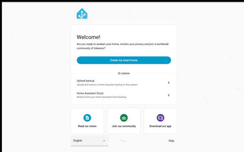
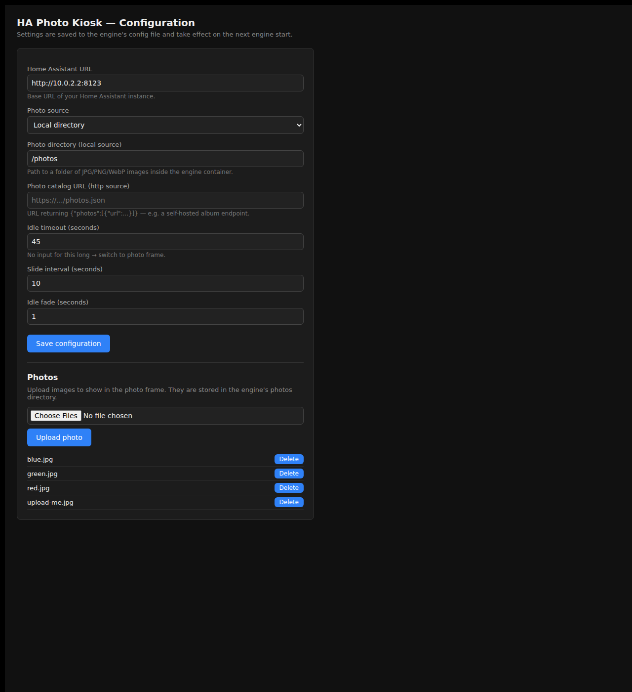
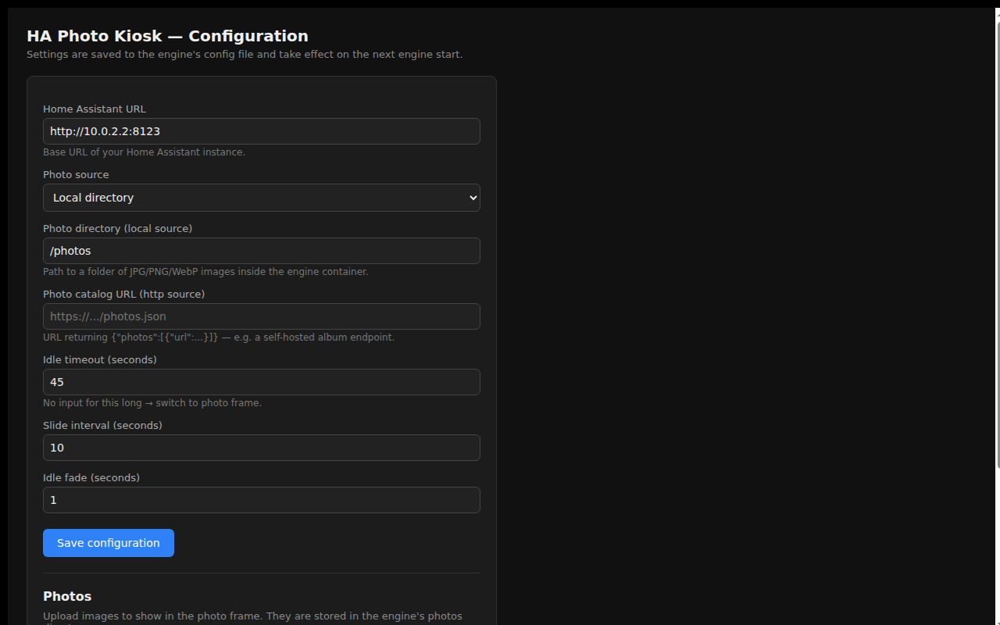
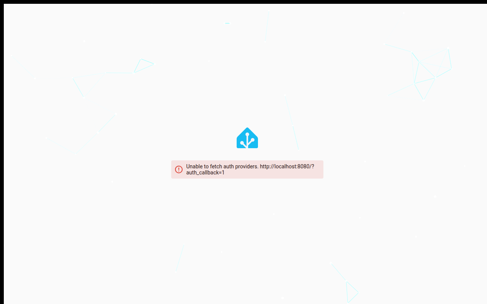

# ha-photo-kiosk

Turn a small Debian box (or Raspberry Pi) into a **two-in-one home display**:
your **Home Assistant dashboard** when people are using it, and a **digital
photo frame** when it goes idle. No browser restarts, ever.



## What it does

```
                  touches / moves / key
   ┌────────┐     ─────────────────▶    ┌────────────┐
   │ ACTIVE │  (Home Assistant shown)   │    IDLE    │ (photo frame)
   └────────┘     ◀─── idle N sec ────  └────────────┘
```

- **Active** — your Home Assistant dashboard, full screen.
- **Idle** — after a few seconds without input, it fades to a photo slideshow.
- Touch / move / press anything → instantly back to the dashboard. The
  dashboard stays loaded in the background, so returning is instant — no
  reload, no re-login.

It's the same "attract mode" pattern used by digital signage and conference
room displays. Set it and forget it.

## How to set it up

> **You configure this from a laptop, not from the kiosk screen.** The whole
> point is that the kiosk is a single-purpose device you barely touch. After
> installing, use your phone/laptop to open its config page and finish setup.

### 1. Install (one command, on the kiosk box)

Pipe the installer straight from GitHub — no clone, no compile:

```bash
curl -fsSL https://raw.githubusercontent.com/kunaalm/ha-photo-kiosk-Py/main/scripts/install.sh | sudo bash
```

(Prefer to read first? `curl -fsSL <that URL>` shows you the whole script before
you run it.) It pulls the pre-built engine container, sets up the display
supervisor, and creates the kiosk user.

Needs: a light Debian OS (Debian, or Raspberry Pi OS) with **Docker**,
and a reachable Home Assistant instance.

### 2. Configure from your laptop

On your laptop, open the kiosk's config page (replace `192.168.1.50` with the
kiosk's real IP):

```
http://192.168.1.50:8080/config/
```



There you set:

- **Home Assistant URL** — e.g. `http://192.168.20.12:8123`
- **Idle timeout** — seconds before it flips to the photo frame
- And you **upload photos** (next step).

Click **Save configuration**, then restart the engine:
`sudo docker restart kiosk-engine`.

> If the kiosk and your laptop are on different networks, tunnel in first:
> `ssh -L 8080:localhost:8080 user@<kiosk-ip>` then open `http://localhost:8080/config/`.

### 3. Add photos — upload them from the config page

The **easiest way is the upload box on the config page** — no file copying,
no ssh, no card removal. Open `/config/`, scroll to **Photos**, pick images on
your laptop, and click **Upload**. They're stored by the engine and shown in
the frame.



Alternative sources:
- **Google Photos** — point the config at your own Google Photos albums (see
  [docs/google-photos.md](docs/google-photos.md)).
- **Local directory** — if the kiosk box itself has images somewhere you can
  reach, or you're comfortable mounting a folder.

### 4. Point Chromium at it

On the kiosk box, the installer already wired the supervisor + systemd to
launch Chromium at the kiosk page on boot.

```bash
sudo systemctl start ha-photo-kiosk.service   # start now
# (it also starts automatically on boot — that's the point)
```

You'll see your dashboard:



…and when idle it flips to your photos:


### Done

That's the whole setup. Touch the screen (or move the mouse) and it's a
dashboard again; leave it alone and it's a photo frame.

## Uninstall

```bash
sudo bash scripts/uninstall.sh            # removes everything
sudo REMOVE_DATA=1 bash scripts/uninstall.sh   # also delete photos + config
```

## How it works (for the curious)

- **Engine** (a container) is the brains: it reverse-proxies Home Assistant,
  serves the kiosk page and photos, and exposes the config + upload service.
- **Supervisor** (a tiny host script) owns the browser: it launches Chromium
  at the kiosk page and restarts it if it crashes.
- **No browser restarts** — the kiosk loads one URL once; the engine
  multiplexes dashboard (proxied) and photos. This is why it's instant.

The design and implementation audit (what each file and function does, how
the logic is split, the data flow): [docs/DESIGN.md](docs/DESIGN.md). The
high-level mental model: [docs/ARCHITECTURE.md](docs/ARCHITECTURE.md),
and the testing walkthrough: [docs/TESTING.md](docs/TESTING.md).

## Options at install time

- `| sudo bash` with the extra flag `--from-source` at the end — installs the
  engine as a Python venv on the host instead of a container (clones the repo;
  for hacking on the code, or boxes without Docker).
- `sudo HA_URL="http://..." bash scripts/install.sh` — pre-seed the Home Assistant
  URL at install time (otherwise set it in the web config).

## Sample photos

[`sample-photos/`](sample-photos/) has a few real photos to try before you
upload your own.

## Local development

```bash
python3 -m venv .venv && source .venv/bin/activate
pip install -r requirements.txt
HA_URL="http://192.168.20.12:8123" PHOTO_DIR="./photos" python apps/app.py
# open http://localhost:8080/
```

## Status

Working end-to-end: engine, supervisor, installer, web config + photo upload,
a real Chrome-based test harness, and Google Photos via the Ambient API.
Additional photo sources remain easy to add behind the pluggable
`Source` interface.